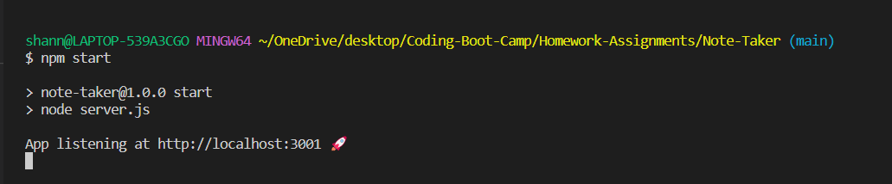
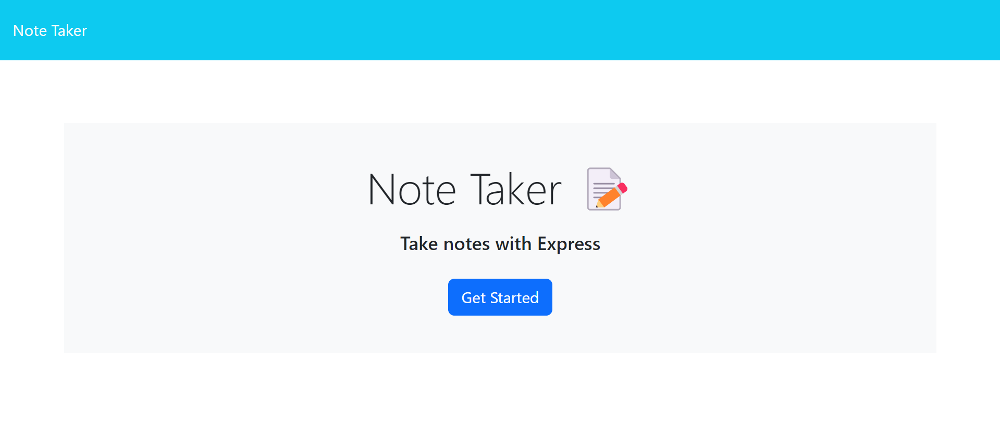
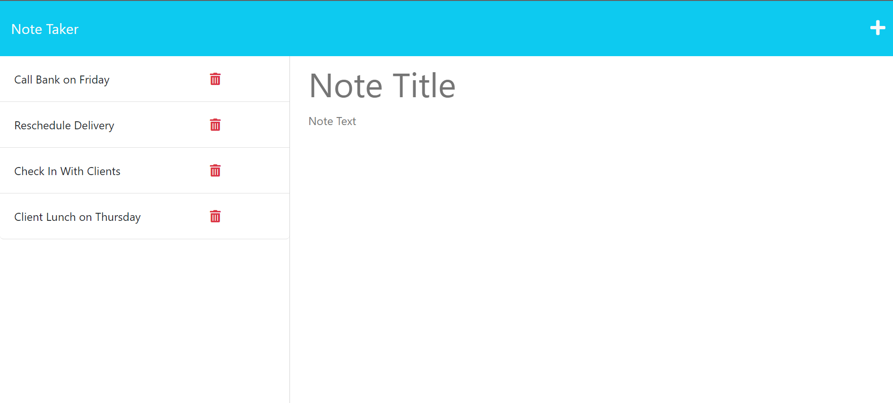
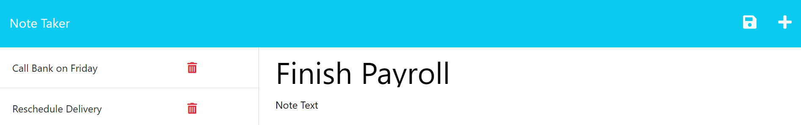

# Note-Taker

## Description
The Note-Taker application is used to write and save notes. It uses an Express.js back end and will save and retrieve note data from a JSON file. This project was created to help business professionals stay organized and have a place to reliably keep persistent data for furture reference. 

## Table of Contents
- [Installation](#installation)
- [Usage](#usage)
- [Credits](#credits)
- [License](#license)
- [Badges](#badges)
- [Tests](#tests)
- [Questions](#questions)

## Installation
To use this project, you will need to install express and uuid as dependencies. You can do this by using the following command in the terminal:   `$ npm i` 

## Usage
This application is deployed using Heroku. You can find a link to the application [here.](#)  
To run the program, use the following command in the terminal:  `$ node server.js`  OR   `$ npm start`  
You will see a message logged that the app is listening and the location where it is listening. You can use that location in your browser to find the home page.   
    
    
  You can click on "Note Taker" in the upper left corner or you can click on the "Get Started" button to be directed to the notes page. 
    
  You can enter your note and once you have filled in all fields, a save icon will appear in the upper right side of the page. Once you click the save icon, your new note will be added to the left column with the rest of your notes. You can use the trash icon to delete any notes no longer needed. 
    

## Credits
Worked with tutor Jacob Nordan to debug functions

## License
MIT License

## Badges

## Tests
N/A 

## Questions
GitHub Profile: [github.com/shannonkprice00](https://github.com/shannonkprice00) 
For further questions, you can reach me at shannonkprice00@gmail.com

